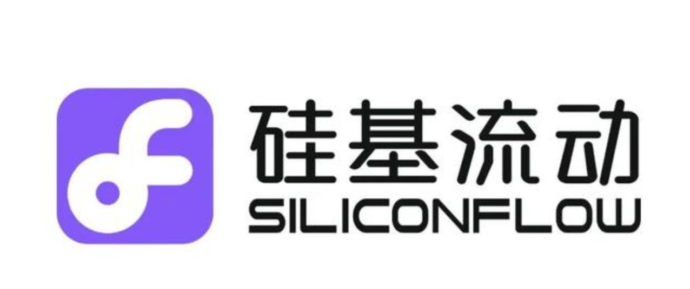
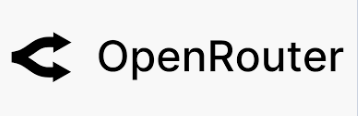

# EZ Translate: 智能浏览器翻译插件

[View English Version (查看英文版本)](README.md)

EZ Translate 是一款现代化的浏览器翻译插件，它利用大型语言模型（LLM）的强大能力，为您提供更加精准、流畅且贴近上下文的网页翻译体验。

与传统的机器翻译不同，本插件旨在通过先进的 AI 技术理解语言的细微差别，生成高质量的译文，帮助您轻松跨越语言障碍，高效获取全球信息。

## 支持的 LLM 提供商

  <table>
    <tr>
      <td align="center" width="200" height="200">
        <a href="https://ai.google.dev/" target="_blank">
           
          <strong>Google Gemini</strong> 
          <small>Google先进AI模型</small>
        </a>
      </td>
      <td align="center" width="200" height="200">
        <a href="https://cloud.siliconflow.cn/" target="_blank">
           
          <strong>硅基流动</strong> 
          <small>中国领先的大模型AI平台</small>
        </a>
      </td>
      <td align="center"  width="200" height="200">
        <a href="https://openrouter.ai/" target="_blank">
           
          <strong>OpenRouter</strong> 
          <small>大语言模型的统一接口平台</small>
        </a>
      </td>
      <td align="center" width="200" height="200">
        <a href="https://ollama.com/" target="_blank">
           
          <strong>Ollama</strong> 
          <small>本地AI部署方案</small>
        </a>
      </td>
    </tr>
  </table>

## 核心功能

*   **多提供商支持:** 支持配置多个大型语言模型提供商 (当前支持 **Google Gemini**、**Silicon Flow**、**OpenRouter** 和 **Ollama**)，让您自由选择最适合的模型。
*   **即时划词翻译:** 在任何网页上选择文本，即可在鼠标旁看到翻译图标，点击后立刻在原地显示翻译结果，体验流畅无打扰。
*   **🆕 右键菜单翻译:** 选中文字后右键点击，直接从上下文菜单访问翻译选项。可选择翻译为主要或次要目标语言，翻译结果将在居中弹窗中显示。
*   **📸 截图翻译:** 捕获网页任意区域，使用AI视觉能力翻译图片中的文字。完美适用于翻译图片、PDF或截图中的文本。
*   **⌨️ 快捷键:** 使用 `Ctrl+Shift+S` (Windows/Linux) 或 `Command+Shift+S` (Mac) 快速激活截图翻译模式。
*   **弹窗快速翻译:** 点击浏览器工具栏图标，在弹出窗口中快速输入或粘贴文本进行翻译。
*   **智能自动填充:** 划词后打开弹窗，选中的文本会自动填充到输入框，简化操作。
*   **一键复制:** 使用内置复制按钮即可快速复制翻译结果，支持视觉反馈和多语言提示。
*   **安全本地存储:** 所有 API 密钥都安全地存储在您本地的浏览器中，绝不上传。
*   **朗读与复制:** 在弹窗中，可以朗读输入和输出的文本，也可以一键复制翻译结果，操作便捷。
*   **智能目标语言设置:** 配置默认和第二目标语言，实现智能翻译切换。
*   **智能语言检测:** 自动检测源语言与目标语言相同时，切换到第二目标语言。
*   **全面多语言支持:** 支持 100+ 种语言，所有界面元素都有本地化翻译。

## 技术栈

*   **前端:** `HTML`, `CSS`, `JavaScript`
*   **浏览器接口:** `WebExtensions API` (兼容 Chrome, Firefox, Edge 等现代浏览器)
*   **语音合成:** `Web Speech API`

## 提供商详情

### 🌐 OpenRouter 集成 (新增)

EZ Translate 现在支持 **OpenRouter**，这是一个统一的 API 平台，提供来自不同提供商的数百个 AI 模型的访问：

**主要特性：**
- **🆓 仅免费模型**: 自动过滤显示名称中包含 "free" 的免费模型
- **🖼️ 图片支持**: 仅显示支持图片输入的模型，用于截图翻译
- **🎯 智能过滤**: 结合两个条件显示最适合翻译任务的模型
- **🔄 统一访问**: 单个 API 密钥即可访问来自 OpenAI、Anthropic、Google、Meta 等提供商的模型
- **📊 模型多样性**: 根据您的需求从不同的模型系列和大小中选择

**快速开始：**
1. 访问 [OpenRouter](https://openrouter.ai/keys) 获取您的 API 密钥
2. 在 EZ Translate 设置中，切换到 "OpenRouter" 标签页
3. 输入您的 API 密钥并点击 "获取模型"
4. 从过滤后的免费、支持图片的模型列表中选择

## 推荐模型

### 各提供商免费模型

| 提供商 | 推荐模型 | 说明 |
|--------|----------|------|
| **Google Gemini** | `gemma3:12b` `gemma3:4b` `gemma3n` | 免费模型，推荐 Gemma 3 12B |
| **Silicon Flow** | `qwen3:8b` `glm-4:9b` `qwen2.5:7b` | 免费模型，推荐 Qwen3-8B |
| **OpenRouter** | `meta-llama/llama-4-scout:free` `google/gemma-3-27b-it:free` `qwen/qwen2.5-vl-32b-instruct:free` | 支持图片的免费模型，自动过滤显示 |
| **Ollama (本地)** | `qwen2:1.5b` `llama3.1:8b` `gemma2:2b` | 本地下载运行 |

### 模型选择建议

* **追求速度**: 选择较小模型 (1.5B-3B 参数)
* **追求质量**: 选择较大模型 (7B+ 参数)
* **追求隐私**: 使用 Ollama 本地模型
* **追求多样性**: 使用 OpenRouter 访问来自不同提供商的数百个免费模型
* **成本考虑**: 以上模型均为免费使用

## 翻译方式

EZ Translate 提供多种便捷的网页文本翻译方式：

### 🖱️ **右键菜单翻译（新功能）**
1. **选中文字** - 在任意网页上选中要翻译的文本
2. **右键点击** - 打开上下文菜单
3. **选择翻译选项:**
   - "翻译为 [主要语言]" - 使用您的默认目标语言
   - "翻译为 [次要语言]" - 使用您的第二目标语言
   - "打开设置" - 快速访问配置页面
4. **查看结果** - 在居中弹窗中查看原文和翻译结果
5. **一键复制** - 使用内置复制按钮快速复制结果

**优势特点:**
- 最快的翻译方式，操作步骤最少
- 直接访问，无需额外界面元素
- 动态菜单标签显示当前语言设置
- 专业弹窗设计，支持复制功能

### 📍 **划词翻译**
1. **选中文字** - 在任意网页上选择文本
2. **翻译图标出现** - 在选中区域附近显示
3. **点击图标** - 查看翻译结果
4. **复制或交互** - 根据需要进行操作

### 🔲 **弹窗翻译**
1. **点击扩展图标** - 在浏览器工具栏中
2. **输入或粘贴文本** - 在输入框中
3. **点击翻译** - 获取翻译结果
4. **使用额外功能** - 如文字转语音等

### 📸 **截图翻译（新功能）**
1. **点击截图图标** - 在弹窗中或使用快捷键 `Ctrl+Shift+S` / `Command+Shift+S`
2. **选择区域** - 在网页上拖拽鼠标选择要翻译的区域
3. **点击"翻译"** - 在选择工具栏中点击翻译按钮
4. **查看结果** - 在弹窗中查看AI识别的文本和翻译结果
5. **复制翻译** - 使用内置复制按钮复制翻译结果

**优势特点:**
- 翻译图片、PDF和截图中的文字
- AI驱动的多模态识别技术，准确理解文字内容
- 适用于网页上的任何视觉内容
- 快捷键快速访问，操作便捷

### ⚡ **智能特性**
- **自动填充**: 选中的文本自动填充到弹窗输入框
- **语言检测**: 自动在目标语言间切换
- **复制保护**: 增强弹窗稳定性，便于文本选择
- **截图快捷键**: `Ctrl+Shift+S` / `Command+Shift+S` 快速进入截图模式
- **键盘快捷键**: 按 ESC 键快速关闭弹窗

## 翻译质量对比

看看 EZ Translate 与其他翻译工具在准确性和流畅性方面的对比：

### 英文到中文翻译示例

| 原文 | Google 翻译 | EZ Translate |
|------|-------------|---------------|
| "Supports one-time, recurring, and usage-based pricing models. Learn more about Subscriptions, Usage-based billing, and Invoicing." | "支持一次性，经常性和基于用法的定价模型。了解有关订阅，基于使用的计费和发票的更多信息。" | ✅ "支持一次性、周期性和基于使用情况的定价模型。了解更多关于订阅、基于使用情况的计费和发票的信息。" |
| "If you're residing in one of China's territories, please select an option for your specific location. You won't be able to change it later." | "如果您居住在中国的一个领土之一，请为您的特定位置选择一个选项。您将稍后再进行更改。" | ✅ "如果您居住在中国的某个地区，请选择您所在的具体位置。您将无法在之后更改它。" |
| "Super cool design and the app idea is a no brainer. Good work" | "超级酷的设计和应用程序的想法是无关紧要的。做得好" | ✅ "超酷的设计，这个应用的想法非常直观。做得好" |

### 主要优势

* **上下文理解**: EZ Translate 比传统机器翻译更好地理解上下文
* **自然流畅**: 更自然流畅的翻译，听起来像人工撰写
* **文化细微差别**: 更好地处理文化表达和习语
* **技术准确性**: 对技术和专业内容的翻译更准确
* **一致性**: 在不同上下文中术语使用更一致

*注意：翻译质量可能因选择的模型和提供商而异。*
